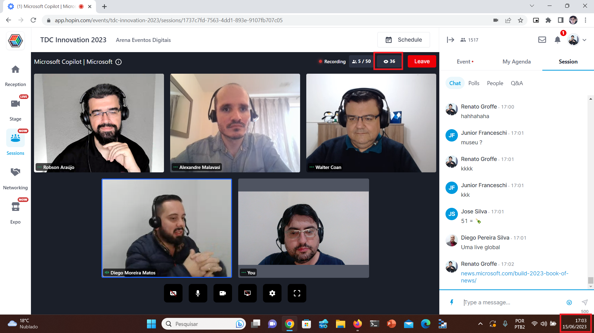
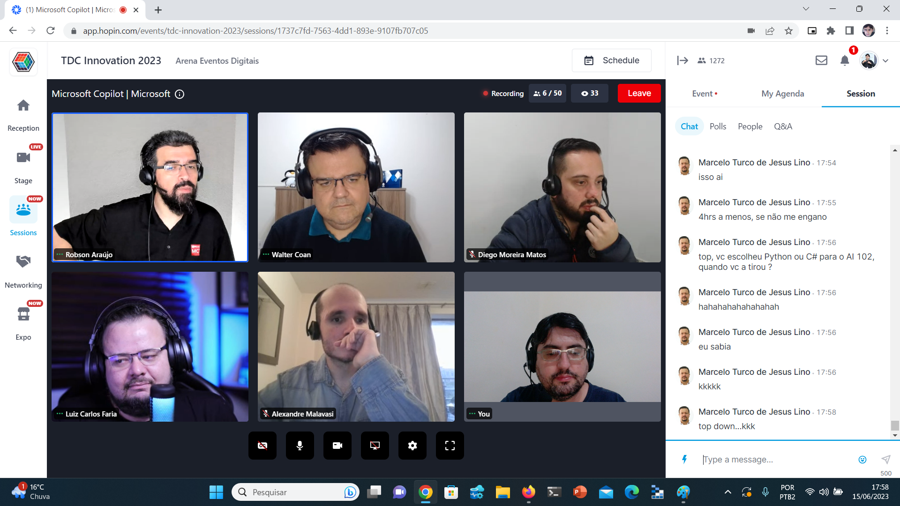
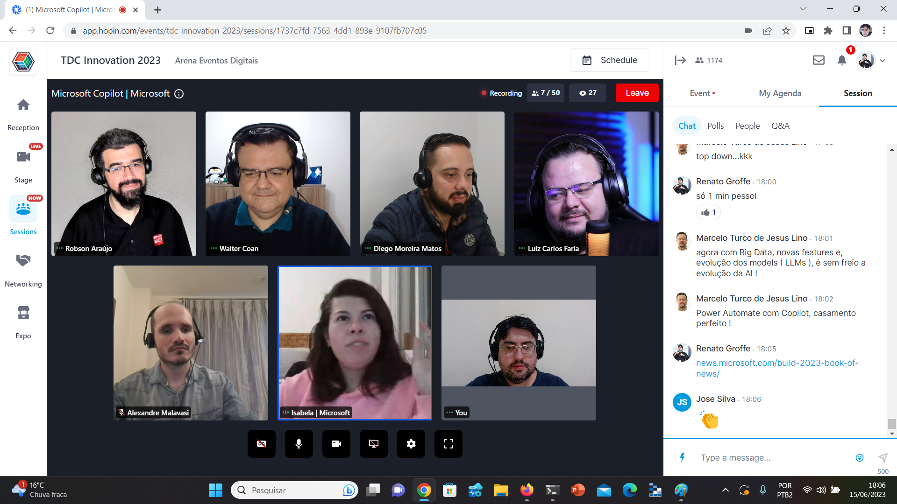
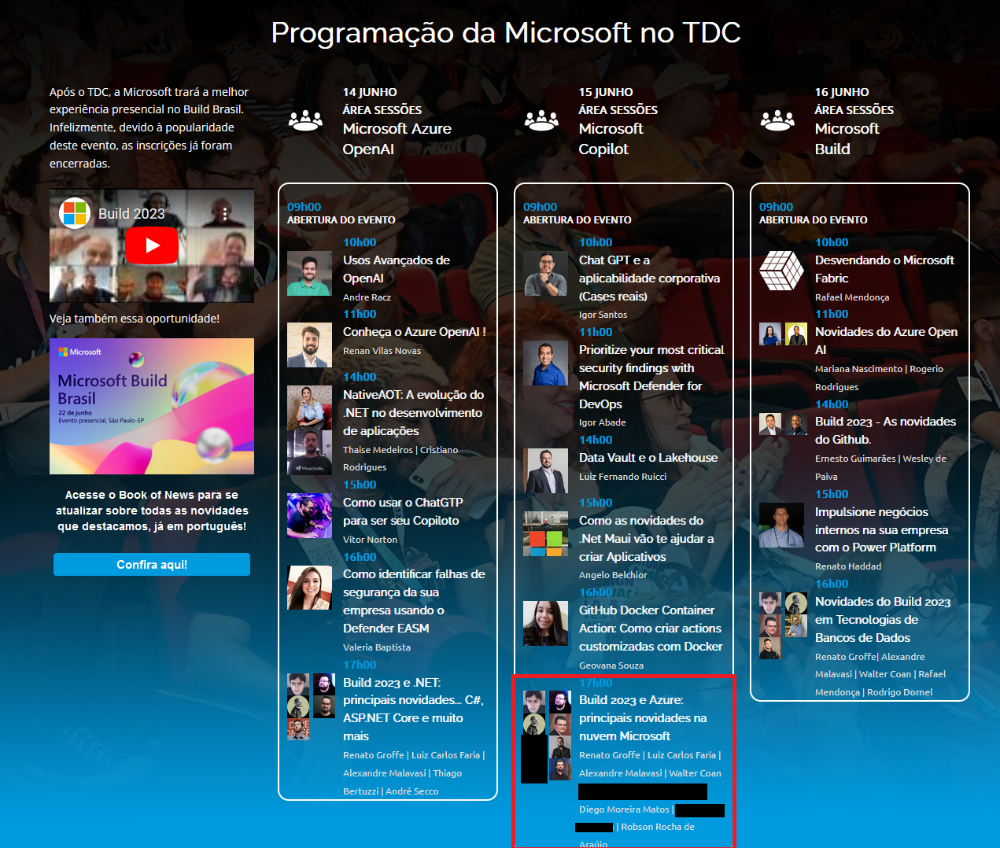

# Talk-Build2023-Azure-TDC_Innovation2023
Informações (incluindo fotos + prints) sobre apresentação online abordando novidades no Microsoft Azure anunciadas durante a edição 2023 do Microsoft Build. Talk realizada durante o TDC Innovation 2023 no dia 15/06/2023 (quinta-feira).

Título da apresentação -> **Build 2023 e Azure: principais novidades na nuvem Microsoft**

Página do evento: [**TDC**](https://promo.thedevconf.com/inn23-microsoft)

Público que acompanhou a apresentação: **36 pessoas** (pico de audiência ao longo da live)

Palestrantes:
- Renato Groffe (Microsoft MVP, MTAC)
- Luiz Carlos Faria (Microsoft MVP, MTAC)
- Walter Coan (Microsoft MVP)
- Diego Moreira Matos (Microsoft MVP)
- Alexandre Malavasi (Microsoft MVP)
- Robson Rocha de Araújo (Microsoft MVP)

Tecnologias abordadas: **Azure Container Apps, Azure Functions, Azure Kubernetes Service, Azure API Management, Azure Container Storage, Cost Management, Power Automate, Copilot, Prometheus**

Na pasta [**/img**](img/) estão outros prints do evento.

Deixamos aqui nossos agradecimentos à **Stéfany Mazon** e à **Isabela Milhomem** pelo convite à comunidade **.NET São Paulo** e por todo o apoio para que participássemos como palestrantes na **Sala Microsoft**.

---

